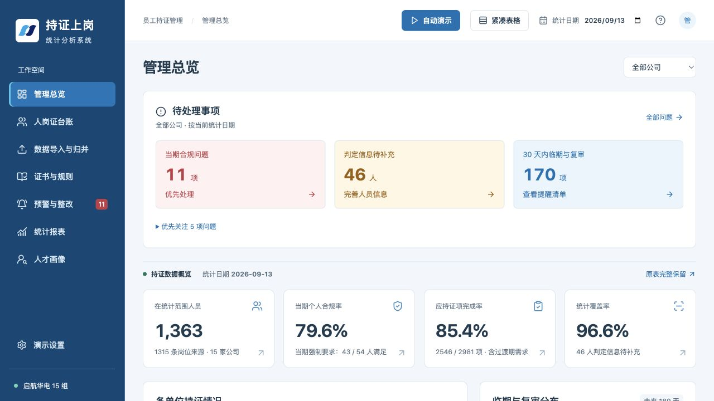

# 持证上岗统计分析系统

一个基于 React、TypeScript 和 Vite 的浏览器本地 Demo，用于演示人员、岗位、证书、持证要求与整改流程之间的关联管理。

无需后端、账号或 API 密钥。数据保存在当前浏览器中，支持导入导出、JSON 备份、恢复和重置。

**[在线演示](https://inori-3333.github.io/license-management-demo/)**



## 功能

- **管理总览**：优先显示合规问题、待补充信息和临期提醒，支持公司筛选、单位排序及明细下钻。
- **人岗证台账**：查询人员、任职和持证情况，编辑记录并追溯岗位来源；返回列表保留筛选、排序、分页和滚动位置。
- **数据导入与归并**：支持岗位、人员、证书数据导入，以及名称映射与人工确认。
- **证书与规则**：配置证书类别、适用专业、岗位、职责、作业范围和时间节点；条件分组及判定依据可展开查看。
- **预警与整改**：覆盖缺证、过期、复审、信息待确认等问题，支持分派、整改、复核、销项和问题重开。
- **统计报表**：支持单位分析、证书分布、缺证清单、临期与复审、阶段目标和整改进度；可选择导出列并保存报表方案。
- **人才画像**：按公司、当前岗位及同时持有的有效证书筛选人选，结合目标岗位与上岗日期评估资格，导出所选人员的培训需求。
- **响应式界面**：桌面表格固定关键列，手机端提供摘要卡片和文字导航；支持舒适、紧凑两种表格密度。

## 自动演示

点击页面顶部的 **自动演示**，默认选择 **精简演示（11 段）**，也可以选择 **完整演示（23 段）** 后开始。两种版本都覆盖 9 个模块；精简版保留导入归并、规则核对、缺证拦截与补证复核、报表导出、人才筛选培训和图谱追溯，完整版继续展示详细维护、异常恢复与各类图谱用法。

可见鼠标会移动和点击，文本逐字输入；讲解随实际操作逐字变蓝，结果停留 1.2 秒后继续。支持暂停、继续、下一条、倍速、重播和退出；重播保持当前版本。播放完成后自动展示该版本的全流程导图，编号与讲解一致；点击阶段回顾对应环节，窄屏就地展开。连线可以暂停，并尊重系统减少动态效果偏好。演示文件可在导图下方下载。

人才画像分两段演示：先按公司、当前岗位和多种有效证书组合筛选，再设置目标岗位与上岗日期，选择人员并导出取证缺口，最后清空筛选、查看无结果状态及恢复列表。

精简版知识图谱用两段串起“聚类找人”和“人员 → 证书 → 规则追溯”。完整版知识图谱分六段演示：全量三维点云的旋转、缩放与居中；证书簇的有效持证／全部记录切换、成员搜索与空结果恢复；多证人员切换关联证书簇、无有效持证关系人员定位；公司、岗位、专业分组及成员分页、人员详情跳转；最后切换实体关系视图，定位人员并追溯证书与适用规则。

演示使用临时数据，原有数据保留不变。鼠标、输入及阅读均可暂停；退出后恢复原页面和数据。本次生成的 Excel、CSV、JSON 和方案文件可从讲解卡片下载。打印通过页面内版式预览展示。

## 本地运行

需要 Node.js 20 或更新版本。

```bash
npm ci
npm run dev
```

默认开发地址为 <http://127.0.0.1:5173/>；端口占用时以终端输出为准。

```bash
npm run build
npm run preview
```

生产文件输出到 `dist/`。项目使用相对资源路径和 Hash 路由，可部署至 GitHub Pages 等静态托管服务，支持仓库子路径。

本仓库已配置 [GitHub Pages 自动部署](.github/workflows/pages.yml)：推送到 `main` 后运行验证和构建，再发布 `dist/`；也可在 Actions 页面手动触发。线上演示与本地开发地址分别保存浏览器数据，需要迁移时可使用设置页的 JSON 备份与恢复。

## 数据与判定口径

- 内置 1,315 条岗位来源，保留 124 处班组空白和 4 处岗位空白；每条来源关联模拟人员，并补充 49 个演示场景。
- 人员姓名和持证信息为模拟数据；任职以岗位来源及补充场景构造。
- 默认统计日期为 `2026-09-13`。共有 1,364 名模拟人员，其中 1 人计划于 2027 年上岗，因此首页初始显示 1,363 名在岗人员。
- 个人强制要求、群体阶段比例与培养建议分别计算。缺少关键字段时保留“待确认”，不将未知信息当作已满足要求。
- 人员合规率、证书要求完成率和统计覆盖率使用各自的分母，报表明细保留分子、分母与统计范围。
- 来源内容存在差异时，采用正文优先的演示口径并保留差异说明；证书期限来自录入记录，不将演示日期解释为法规要求。
- 编辑、导入、名称映射、整改记录和报表方案保存在当前浏览器，不会在不同浏览器或访问地址之间自动同步。

原始 PDF、DOCX 仅保留在本地 `sources/`，通过 `.gitignore` 排除，不包含在仓库或静态构建中。用于来源核对的岗位工作簿随仓库提供。

## 验证

```bash
npm test
npm run verify:data
npm run build
npm run verify:pages
npm run verify:ui
npm run format:check
npm run test:demo # 需要已安装 Google Chrome
```

自动化测试覆盖证书日期边界、规则匹配、未知状态、导入与归并、整改校验和报表统计等行为。来源核对脚本逐行、逐字段对照岗位工作簿；生产资源检查验证静态托管子路径。

自动演示的最新回归覆盖桌面、手机、组合筛选、培训导出和数据恢复，见[自动演示更新验收](docs/auto-demo-update-2026-09-22.md)。此前的搜索、选择、详情返回、弹窗、排序和密度切换验收见[前端验收记录](docs/frontend-update-2026-09-20/验收记录.md)。

## 项目结构

```text
src/
  components/       岗位搜索选择、规则条件等共享组件
  data/source.json  岗位来源四列与原始行号
  pages/            业务页面
  model.ts          数据类型
  policy.ts         初始持证要求
  engine.ts         统一判定与统计计算
  seed.ts           可重置的演示数据
  store.tsx         状态管理与浏览器本地存储
  io.ts             导入与导出
  reports.ts        报表数据
  ui.tsx            表单、表格、弹窗等共享交互
tests/             业务回归测试
scripts/           数据、设计、构建资源核对脚本
sources/           岗位工作簿与本地参考资料
docs/              设计方案、验收记录和截图
```

设计约定见 [DESIGN.md](DESIGN.md)，交互约定见 [UX-CONTRACT.md](UX-CONTRACT.md)。视觉 tokens 由 `npm run tokens` 从设计文件生成。
