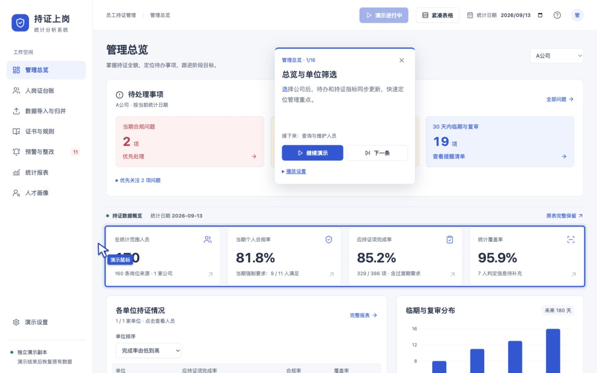
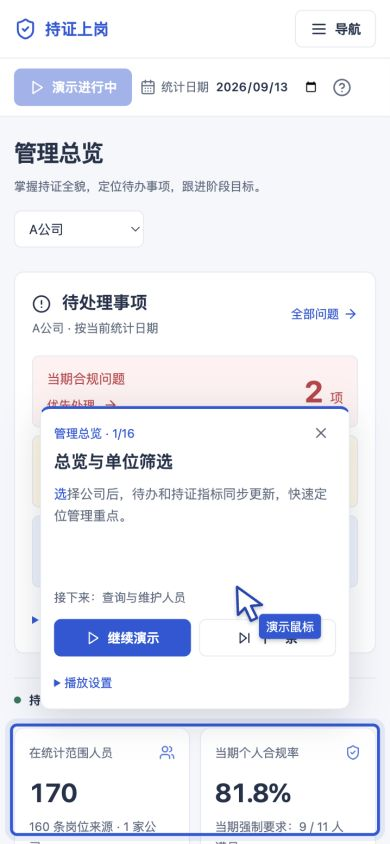
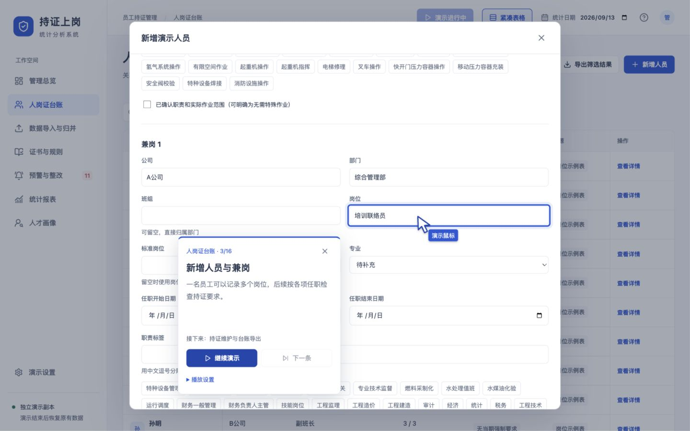
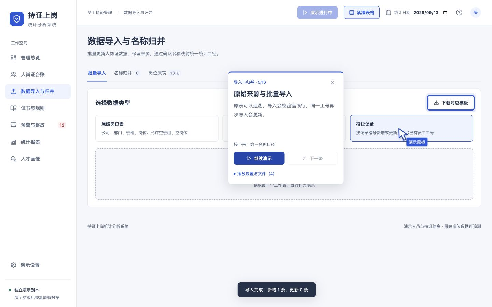
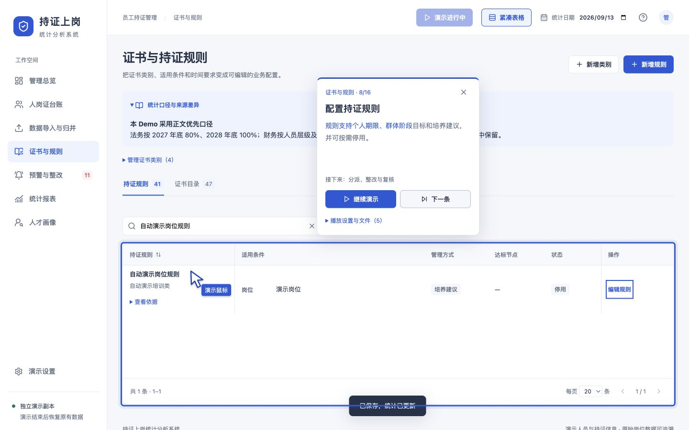
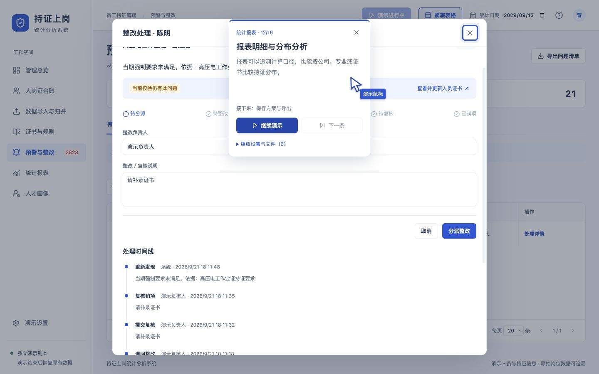
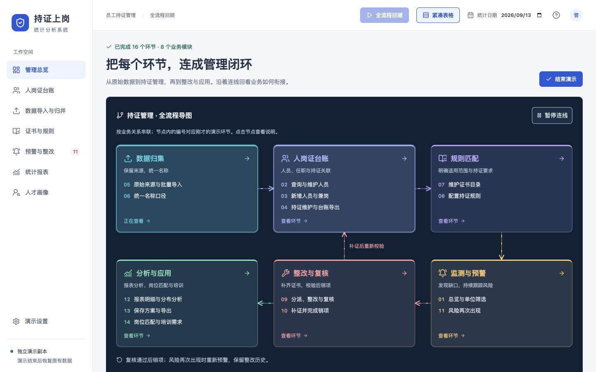
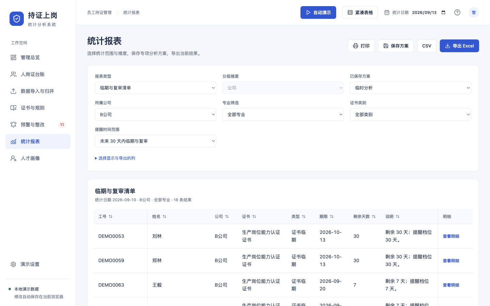
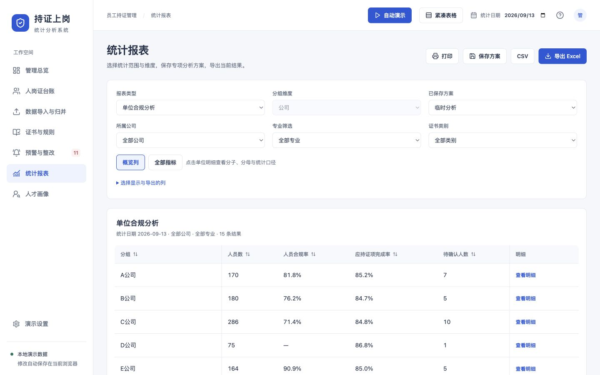

# 自动演示体验审查

日期：2026-09-21。对象：当前工作区通过 `http://127.0.0.1:5173/` 提供的前端版本。只审查和记录证据，没有修改产品代码。线上部署不在本次结论范围内。

## 结论

16 段业务演示、可见操作指针、结果就位后的逐字讲解，以及独立演示副本已经形成完整基础。下一轮应优先解决观看控制和结果表达：让观众随时能停住、能定位感兴趣的章节、能看清操作前后的变化。

保留现有业务界面、逐字变色、阅读期间稳定和空闲操作提示留白。以下建议不要求增加后端、账号或权限系统。

## 按观看顺序的审查记录

1. **入口与总览（演示 1）——可用，信息被局部遮挡。** 自动演示直接开始，桌面可见独立演示副本提示，能筛选 A 公司并更新指标。缺少开播前的路线和时长预期。
2. **人员台账、兼岗与持证（演示 2–4）——可运行，控制有改进空间。** 看到工号定位、编辑任职、兼岗表单和证书维护过程；长操作期间不能跳章，窄屏卡片占用较多空间。
3. **导入与归并（演示 5–6）——流程贯通，节奏较重。** 演示执行了多类导入、重复工号更新和名称归并；过程中出现两次点击暂停未停住的现象。
4. **证书与规则（演示 7–8）——可完成，结果解释不足。** 新增证书和规则可见；规则最后为“培养建议／停用”，没有呈现对人员判定的影响。键盘可进入被拦截输入的字段。
5. **整改、复核与风险重现（演示 9–11）——闭环状态有证据，说明文本需修正。** 连续运行后检查处理时间线，确认分派、整改、退回、再次提交、销项和重新发现记录。没有逐帧截取第 9–10 段的每个中间状态；结论来自本次运行后的时间线与当前代码核对。
6. **报表与人才画像（演示 12–14）——流程可继续完成，展示仍以操作为主。** 观察到报表方案、导出文件计数与目标岗位页面，后续自动运行到收尾。未逐项打开导出文件核对内容，也未操作系统打印对话框。
7. **备份、重置与结束导图（演示 15–16 及完成页）——完成，可进一步提供章节重播。** 已到达“已完成 16 个环节”的导图；文件入口显示 11 个文件。点击“整改与复核”显示对应两段说明，说明位于图下，需要滚动阅读；目前节点只查看说明，没有直接重播该段的入口。结束后首页及可见原统计值恢复。
8. **从临时报表启动并退出——存在明确的上下文丢失。** 第二轮针对恢复的短流程复现：B 公司／30 天临期清单在退出后变为全部公司／单位合规分析。详见第 7 项。

### 当前截图

总览：高亮 KPI 可见，但相关待办被卡片遮挡。

手机总览：讲解占用较大空间。此图是在第一段暂停后调整视口得到，不代表从手机尺寸开始的完整播放流程。

长表单：操作未完成时下一条禁用，相邻字段被讲解卡片覆盖。

批量导入：同一段中继续切换模板和导入类型，卡片仍为整体介绍。

规则配置：最终看到的是停用的培养建议规则。

整改时间线：复核销项记录仍附有“请补录证书”的说明。此图捕获于下一段准备开始时，讲解标题已切换为报表，背景仍为上一段的整改弹窗。

完成后的流程导图能够把 16 段按业务关系重新组织，值得保留。

退出前后对照：原来是 B 公司未来 30 天临期清单，退出演示后恢复了报表路由，却丢失了临时分析条件。

## 优先改进项

### 1. 固定播放控制的位置（P1）

**本次观察：** 名称归并连续操作期间，两次点击“暂停演示”后，后续可见状态仍为“暂停演示”，演示继续从选项选择运行到修改映射；随后按 Escape 成功暂停。不同区域中的卡片和按钮位置变化很大。截图 09、10 展示这段流程的状态，具体点击结果来自本次浏览器操作记录，静态截图不能单独证明点击丢失。

**影响：** 观众想停下来理解内容时，需要追着卡片找按钮。

**建议：** 暂停、继续、退出和章节入口放在固定控制栏；讲解卡片仍可随目标避让。显示 Escape 快捷提示。为真实指针进入播放控件的过程保持控件位置稳定。

**证据边界：** 本次确认了两次点击未停住的现象；卡片位移是需要验证的原因，尚未通过事件轨迹定位根因。相关实现：`src/demo/AutoDemo.tsx` 的 Presentation 定位及 `.demo-card-controls`。

### 2. 讲解需要避开整组相关信息（P1）

**本次观察：** 总览讲解避开了 KPI 高亮区，却遮住中央的“判定信息待补充”；人员表单里会遮住相邻字段。390px 宽度下，讲解卡片占据大块视口，结果需要在剩余空间中阅读。截图 02、03、05、07。

**影响：** 当前目标可见，但理解目标所需的上下文被挡住。

**建议：** 桌面优先利用稳定侧区；手机提供紧凑讲解和展开全文，控制栏固定。将当前业务结果区域也作为避让对象。保留空闲提示留白，但按视口设置较紧凑的固定尺寸，避免阅读时反复收缩。

**实现线索：** `src/demo/presentation.ts` 的 `placeCallout` 只计算 target 和选项预览的重叠；`src/demo/AutoDemo.tsx` 的布局按当前 target/region 定位。

### 3. 让长章节可定位、可回看（P1）

**本次观察：** 新增人员、导入和规则配置执行时，“下一条”为禁用。只显示当前 `n/16` 和下一条标题，没有上一条、章节目录或剩余时长。第 5 段内部包含三种数据模板/导入和一次再次导入更新。截图 05、08、12。

**影响：** 16 段的标号无法反映每段操作量；观众无法直达整改等感兴趣的内容，也无法重看刚刚错过的一段。

**建议：** 先将现有按钮明确为“跳过本段讲解”，增加章节目录、重播本段及预计时长。需要任意跳章时，用预设演示状态或检查点准备前置数据，不能只跳过依赖步骤。可提供精简闭环与完整操作两种入口；具体时长以实际测量为准。

**实现线索：** `src/demo/AutoDemo.tsx:95` 顺序运行全部步骤；`:207` 以 ready 禁用下一条；`:209` 仅改变 skipReading。

### 4. 强化“操作后发生了什么”（P2）

**本次观察：** 规则章节依次展示个人期限、群体目标、培养建议与停用，最终停在一条已停用的培养建议规则。讲解仍是功能概述，没有展示哪些人员的判定发生变化。总览说明“指标同步更新”，但没有记录筛选前后的比较。截图 02、12。

**建议：** 每段保留一个具体结论，直接指向真实页面结果，例如“该人员新增两项任职”“本次导入新增 1 条、错误 1 条”“缺证未解决，不能销项”。高亮新增行或发生变化的数值。错误行、复核拒绝等关键判断应有独立的短暂停留，不必重新拆成大量零散章节。

**内容组织：** 将同一个人的发现问题、补证、复核、指标变化作为精简演示主线，目录维护和模板操作放入完整演示。

### 5. 观看模式中的键盘焦点需要一致（P2）

**本次观察：** 暂停在证书类别弹窗时，Tab 可以进入“类别名称”输入框；输入字符没有写入。字段仍呈现可编辑外观。代码也确认演示期间允许 Tab，但拦截业务控件的输入和点击。

**影响：** 键盘使用者能进入看起来可操作、实际上被屏蔽的控件；若不知道观看模式限制，会认为界面失灵。

**建议：** 清晰标识观看模式，并让键盘快速回到播放控制；业务区域的可操作语义与观看限制保持一致。如果增加“自行体验”，应显式退出脚本接管并保留演示副本，而不是让自动脚本与人工输入同时运行。

**实现线索：** `src/demo/AutoDemo.tsx:60-83`。没有进行读屏软件验证，不能据此声称全面无障碍合规。

### 6. 整改成功记录仍显示“请补录证书”（P2）

**本次观察：** 陈明的高压电工作业证时间线已经包含“退回整改 → 提交复核 → 复核销项 → 重新发现”，但补证后的“提交复核”和“复核销项”记录说明仍为“请补录证书”。截图 14 同时显示“复核销项”和这条说明。

**影响：** 演示本来要证明整改闭环，结果文本却像仍未完成补证，削弱可信度。

**建议：** 演示退回时填写“请补录证书”，补证后提交时改为“已补录有效证书，请复核”，通过时改为“证书信息及有效期已核验，准予销项”。风险重新出现时，明确说明是推演统计日期导致的新风险。

**实现线索：** `src/demo/steps.ts` 的“补证并完成销项”仅在退回前填写说明，补证后没有为提交与销项填写相应新说明。此项是演示内容修正，不涉及变更业务判定规则。

### 7. 退出恢复路由，但未恢复临时报表条件（P1）

**复现步骤：**

1. 打开统计报表，选择“临期与复审清单”。
2. 选择“B 公司”和“未来 30 天内临期与复审”；页面为 18 条结果。
3. 点击“自动演示”，随后点击“退出演示”。
4. 回到 `#/reports`，却成为“单位合规分析／全部公司”，页面为 15 家单位。

**影响：** 虽然业务数据和路由恢复，观看前正在进行的分析被清空。截图 20、21 为同一次复现的前后对照。这里只确认临时报表条件丢失，没有声称已保存方案或业务数据丢失。

**建议：** 启动前保存当前页面的临时视图状态，结束与中断都恢复；或保持原工作页面实例与演示实例分离。优先覆盖报表类型、范围、分组和选列，然后核对人才目标岗位与已选人员。

**实现线索：** `src/App.tsx:168` 仅保存 path/top/density，`:216` 切换 Routes 的 key 使页面重新挂载；`src/pages/Reports.tsx:12` 将 config 存在组件 state，且条件更改未同步进 URL。

## 建议实施顺序

第一批：恢复临时页面状态、固定播放控制、改善窄屏和相关信息避让；同时修正销项说明。

第二批：章节目录与重播、精简业务主线、操作结果的前后对照，以及键盘观看模式的一致性。保留完成导图，并在节点提供重播该段的入口。

## 验证记录

- `npm test`：61 项通过。
- `npm run verify:ui`：通过，涵盖 token 映射和脚本列出的文字对比度。
- `npx tsc --noEmit`：通过。
- strict 静态审查：0 errors / warnings / violations，见 `static-audit.json`。
- 当前浏览器记录中未发现 warning/error 日志；不代替全部运行环境验证。
- 浏览器：Codex 内置浏览器；桌面 1440×900，窄屏 390×844，并观察了默认约 832px 宽度。主要使用产品自带的 2× 速度，第一段也观察了标准速度。
- 本次截图是当前运行重新捕获；没有把历史验收截图或历史测试结果作为当前版本证据。
- 移动端覆盖布局和部分表单/结果状态；不是物理手机、触摸键盘或完整移动端流程验收。截图 06 在调整视口后捕获异常，已拒绝作为审查证据。
- 主演示已运行至完整结束导图；并另做一次从统计报表开始、立即退出的恢复测试。没有逐帧观察所有 16 段的每个动作，未捕获的中间状态已在上述分步记录中说明。
- 本轮没有重新运行现有 Playwright 端到端套件，也没有执行发布构建或核对线上版本。没有修改 `src`、设计约定或业务数据。
